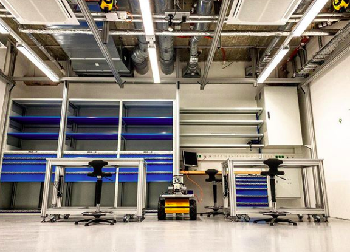

# akig_2020
AKIG 2020 TU Wien




In diesem Jahr soll im Rahmen von AKIG der selbst fahrende Roboter [Husky](https://clearpathrobotics.com/husky-unmanned-ground-vehicle-robot/) um Funktionen im Zusammenhang mit dem Tachymeter erweitert werden. Neben der 2D- und 3D-Aufnahme des Raumes ist in der Ingenieurgeodäsie vor allem die Bewertung der Genauigkeit und Zuverlässigkeit der erzeugten Daten von Bedeutung. Zu entwickeln ist ein maximal autonom agierendes System, welches in der Lage ist sich selbstständig in einem zu schaffenden Industriemessnetz zu orientieren und zu navigieren. Als Methode kommen für den Husky bereits implementierte [ROS-Packete](http://wiki.ros.org/Robots/Husky) wie etwa [gmapping](http://wiki.ros.org/gmapping) zum [Einsatz](https://www.youtube.com/watch?v=XQg-1DZRqQo). 


Das Tachymeter erzeugt ground-truth Daten wie sie in der Robotik allgemein nicht zur Verfügung stehen, Daher sind neue Ansätze zu entwickeln die mit Blick auf die bekannten geodätischen Methoden auch in der Informatik eingang finden können.

Folgende Meilensteine wurden bisher definiert:

- Aufbau eines Messnetzes
- Anschluss des Messnetz ans Landesnetz
- Tachymetersteuerung mit Hilfe der verfügbaren Matlab-Toolbox
- Automatisches Tracking der Robotertrajektorie mittels Tachymeter (Tachymeter steht extern)
- Automatische Aufnahme von Zielzeichen und Bestimmung der Pose (Tachymeter fest auf Roboterplattform)
- Erzeugen einer 2D Karte der Umgebung, Transformation dieser Karte ins übergeordnete Netz
- Aufnahme einer 3D Punktwolke, mittels 2D Laserscanner und bekannter dynamischer Pose

Es wird im folgenden davon ausgegangen, dass die Installation eines passenden [Ubuntu Systems (16.04, 18.04 oder 20.04)](https://ubuntu.com/download/desktop) mit dem dazu gehörigen [ROS-System (kinetic, melodic oder noetic)](http://wiki.ros.org/ROS/Installation) bereits vollständig durcheführt wurde. Spieziell für Raspberry Pis (Version 4) ist eventuell folgender [Blogeintrag](https://finnlinxxx.github.io/RaspRos4/) hilfreich.

## 0.1 Installation - Husky

In Anlehnung an das [ROS-Tutorial](http://wiki.ros.org/ROS/Tutorials), soll ein eigener Workspace auf dem Raspberry Pi, der virtuellen Linux Umgebung oder sonst irgendeinem Linux-System auf dem Ubuntu läuft, erzeugt werden (siehe Kapitel [1.3.](http://wiki.ros.org/ROS/Tutorials/InstallingandConfiguringROSEnvironment)). Statt `catkin_ws` ist ein anderer Name zu wählen, etwa `workspace_husky`. Im dazu gehörigen `workspace_husky/src` Ordner können beliebig viele [ROS-Packages](http://wiki.ros.org/Packages) abgelegt werden, `catkin` übernimmt einen großteil der Verwaltung zur Erzeugung lauffähiger Programme bzw. Nodes. 

Um einzelne bereits vorhandene und gut getestete Packages zu installieren die Paketmanager-Option `apt install` benutzen. Die Packages werden tief im System installiert `$ cd /opt/ros/noetic/...` und stehen somit jedem Benutzer zur Verfügung, evtl. muss vor dem Verwenden das Terminal neu gestartet werden oder `$ source ~/.bashr` erneut ausgeführt werden.
```bash
$ sudo apt install ros-melodic-imu-tools
$ sudo apt install ros-melodic-xsens-driver
$ sudo apt install ros-melodic-eigen-stl-containers
$ sudo apt install ros-melodic-tf2-sensor-msgs
$ sudo apt install ros-melodic-pcl-ros
(oder eben)
$ sudo apt install ros-noetic-imu-tools
$ sudo apt install ros-noetic-xsens-driver
$ sudo apt install ros-noetic-eigen-stl-containers
$ sudo apt install ros-noetic-tf2-sensor-msgs
$ sudo apt install ros-noetic-pcl-ros
```

Grundsätzlich stehen auch installierbare Packages für den Husky oder den Laserscanner zur Verfügung, jedoch wollen wir in Zukunft im verfügbaren Quellcode selbst entwickeln, sodass eine einfache Installation nicht in Frage kommt. Der Sourcecode soll für die Art Pakete in einen eigenen Workspace geladen werden und liegt somit an der dieser Stelle verwaltet vor.

Folgende Packete sind mit folgenden Befehlen in den Workspace zu laden :
```bash
$ cd ~/workspace_husky/src
$ git clone https://github.com/husky/husky.git
$ git clone https://github.com/clearpathrobotics/LMS1xx
$ git clone https://github.com/team-vigir/vigir_lidar_proc.git
$ cp -r ~/akig_2020/src/mss_tools .
```
Außerdem ist mittels `git` der für das eigene System benötigte Branch auszuwählen (in diesem Beispiel im Bezug auf die ROS Version `noetic`). Ist kein passender Branch für das eigene System verfügbar kann das nächstbeste ausgewählt werden, eventuell ist dieses trotzdem über catkin kompilierbar:
```bash
$ cd ~/workspace_husky/src/husky
$ git checkout noetic-devel
$ cd ..
$ cd ~/workspace_husky/src/MS1xx
$ git checkout noetic-devel
```
Anschließend ist der Workspace mit `$ catkin_make` zu kompilieren, eventuell auftretende Fehlermeldungen sind zu behandeln.
```bash
$ cd ~/workspace_husky
$ catkin_make
```

Die Anmeldung des Workspaces ins System erfolgt wie gewohnt über den `$ source .` Befehl, etwa:
```bash
$ source ~/workspace_husky/devel/setup.bash
```
Praktischerweise sollte dieser Befehl nach eigenem Ermessen in die `$ nano ~/.bashrc` geladen werden, um bei jedem Terminal verfügbar zu sein.

Anschließend muss die Node 
```bash
$ roslaunch husky_viz view_robot.launch
```
aufrufbar sein. Es startet das bereits bekannte rviz Visualisierungstool mit getroffenen Voreinstellungen die im Bezug auf den Husky optimiert wurden. Ist das rviz Fenster geöffnet kann aber sogleich in der Linken Spalte der Haken bei `Sensing/Odometrie` ⬜️ entfernt werden, da dies für die nun folgende Visualiserung hinderlich ist. Dafür sollte aber der Haken bei `Navigation` ✅ gesetzt werden, um eine sich aufbauende Karte beobachten zu können. Zusätzlich sollen in rviz über `>> Add >> TF >> Ok` die TF-Frames ebenfalls visualisiert werden. 

Ein passendes rosbag, dass zuvor erfasste Sensordaten des realen Huskys erneut ins System ausspielt kann über [TUWEL](https://tuwel.tuwien.ac.at/course/view.php?id=33880) geladen werden (TU Zugangsdaten notwendig).

Bagfiles nehmen grundsätzlich den gesamten Datenstrom des ROS-Masters auf, dafür kann im laufenden Betrieb folgender Befehl ausgeführt werden.
```bash
$ rosbag record -a
```
Allerdings fallen im Fall des Huksy innerhalb weniger Sekunden mehrere 100 MB Daten an, daher wurde für das folgende Beispiel das erzeugte rosbag mit der filter Methode ausgedünnt:

```bash
$ rosbag filter my_big_record.bag huskdrive_90degcorner_5m_sparse.bag "topic == '/tf' or topic == '/tf_static' or topic == '/scan' or topic == '/map'"
```
Übrig bleibt ein rosbag mit den für den Anfang wichtigsten topics.

Das dort heruntergeladene Bagfile `huskdrive_90degcorner_5m_sparse.bag` kann wie gewohnt über den folgenden Befehl ausgeführt werden.
```bash
$ rosbag play huskdrive_90degcorner_5m_sparse.bag --loop
```
In Rviz sollte die Punktwolke, die sich aufbauende Karte und die vielen verschiedenen TF-Frames visualisert werden. Der Husky-Roboter fährt in diesem Beispiel auf etwa 5 Meter Distanz eine 90 Grad Kurve um eine Ecke, die Aufnahme ist nur 10 Sekunden lang und wiederholt sich wegen dem `--loop` Argument fortlaufend. Eventuell ist in rviz ganz unten link der "reset" Button zu drücken, um die Visualiserung vom neuen zu zeigen.

Über den Befehl
```bash
$ rostopic list
```
können alle zur Verfügung stehenden Topics eingesehen werden. 

Die zueinander stehenden Koordinatensyteme (TF-Frames bzw. /tf) sind für dieses Projekt vom großen interesse. Verfügbare und in rviz einsehbare Frames und wie diese zueinander im Verhältnis stehen (zb. map zu base_link) können über folgenden Befehl eingesehen werden.

```bash
$ rosrun tf tf_echo map base_link
```
Im Weiteren ist die Auswertung mit Programmcode zu erfolgen, vorzugsweise mit Python (siehe weiter unten).

## 0.2 Installation - Sick&xsens 3D PW-Transformation


Die Aufnahme erfolgte mit dem Befehl:
```bash
$ rosbag record /scan_cloud /imu/data /imu/data_raw /transformed_ptcl
(strg+c)
$ mv name_or_record.bag sensorikraum2.bag
```

## 1. Provide Fixed-point field
`Andreas S. -`

Zur Verfügung stellen einer [PointCloud](http://docs.ros.org/en/melodic/api/sensor_msgs/html/msg/PointCloud.html) die die Fixpunkt der Netzmessung im 2. Stock der Ingenieurgeodäsie.

`Ziel - Die Aufgabe ist dann gelöst, wenn `

## 2. Publish PoseStamped
`Victoria`
Ermitteln der akutellen Pose und publishen eines Topics, welches dies als [PoseStamped](http://docs.ros.org/en/melodic/api/geometry_msgs/html/msg/PoseStamped.html) angebibt.

`Ziel - Die Aufgabe ist dann gelöst, wenn `


## 3. Publish Hz, V, D
`Matthias - `

Aufgreifen der [PointCloud](http://docs.ros.org/en/melodic/api/sensor_msgs/html/msg/PointCloud.html) von Andreas, um diese um [ChannelFloat32](http://docs.ros.org/en/melodic/api/sensor_msgs/html/msg/ChannelFloat32.html) zu erweitern. Die Erweiterung betrifft zu jedem Punkt der PointCloud der dazu gehörige `hz`,`v`,`d`,... Wert welcher sich über den PoseStamped von Victoria ergibt.

`Ziel - Die Aufgabe ist dann gelöst, wenn `


## 4. Publish 2D probability Map
`Max - `
Publishen einer probability Map, diese soll bezogen auf eventuell ground-truth Daten skalierbar sein.

`Ziel - Die Aufgabe ist dann gelöst, wenn `

## 5. Publish transformed Pointcloud
`Andreas B. -`

Um `sensorikraum2.bag` auswerten zu können musste ich zunächst das bagfile in Ordnung bringen. Hierfür habe ich ein eigenes python skript erstellt, in dem die `child_frame_id` des `/imu/data`-Topics von `/imu` auf `imu` geändert wird. Der char `/` ist in diesem zusammenhang nicht erlaubt.

`$ nano rewrite_frame_id_rosbag.py`
```python
import rosbag
import sys

inbag_name = sys.argv[1]
outbag_name = inbag_name.replace('.bag', '-fixed.bag')

with rosbag.Bag(outbag_name, 'w') as outbag:
    for topic, msg, t in rosbag.Bag(inbag_name).read_messages():
        if topic == "/imu/data" and msg.header.frame_id:
            msg.header.frame_id = "imu"
            outbag.write("/imu/data", msg, t)
        else:
            outbag.write(topic, msg, t)
 ```
 Zum verwenden:
 ```bash
 $ python3 rewrite_frame_id_rosbag.py sensorikraum2.bag
 ```
Die erstellte `sensorikraum2-fixed.bag` Version kann anschließend weiter verwendet werden.

---

Nun könnten die Topic `/imu/data`, `/scan_cloud` und `/transformed_ptcl` in `rviz` visualisiert werden. Hierfür einfach über `>>File >> Open Config >> xsenssick3d.rviz` des codebeispiele Ordners laden. Um auch das `/imu/data_raw` Topic laden können, muss dieses im rewrite_frame_id_rosbag.py-Skript angepasst werden.

```bash
$ roscore
$ rosparam set /use_sim_time true
$ rosbag play --clock sensorikraum2-fixed.bag --loop
$ rosrun tf2_ros static_transform_publisher 0 0 0 0 0 0 map laser
$ rosrun tf2_ros static_transform_publisher 0 0 0 0 0 0 map imu

$ rosrun rviz rviz
(Entweder die xsenssick3d.rviz Datei laden oder...)
(Add >> rviz_imu_plugin/Imu >> Ok und in rviz in der linken Spalte topic wählen und "enable box ✅" und dort _scale anpassen)
(Add >> TF >> Ok)
(Add >> PointCloud2 >> Ok)
```

Angenommen man möchte das `/scan_cloud` Topic um 7 Meter in x-Richtung verschieben, dann muss nur der `laser`-Frame angepasst werden, etwa:
```bash
$ rosrun tf2_ros static_transform_publisher 7 0 0 0 0 0 map laser
```
Die `/transformed_ptcl` zu verschieben/verdrehen ist nicht so ohne weiteres möglich, da diese als `frame_id:=map` hat und die `map` liegt definitionsgemäß im Ursprung, aber auch hier wäre eine Anpassung/Umschreibung mit dem `rewrite_frame_id_rosbag.py` möglich. 

Um nun die lokal vom SICK gemessene `/scan_cloud` im Bezug auf die Örtlichkeit zu transformieren steht das `/imu/data` Topic zur verfügung, dass die zeitlich passende Orientierung des Systems zur Verfügung stellt. Koordinaten wurden in diesem Zusammenhang nicht bestimmt, bei einer reinen Verdrehung des Systems ist dies zu vernachlässigen (0,0,0). 

Zunächst muss in der Algorithmik ein neuer TF-Frame erzeugt werden, welcher nicht statisch, sondern im Bezug auf die festzustellende Verdrehung der IMU ausgerichtet werden muss, im folgenden `prisma_frame` genannt. Die Punktwolke der `/scan_cloud` muss anschließend auf die `frame_id:=prisma_frame` bezogen werden, sodass eine räumliche Transformation erzeugt werden kann.

Der Installation von oben folgend liegen im `$ cd ~/workspace_husky/src/mss_tools`-Ordner passende Packages vor. Diese wurden in C++ geschrieben.

`1. platform_tf` mit dem C++ Programm `listen_platform_tf_talker.cpp`

Erzeugt den TF-Frame, ausführbar mit (wenn keine `tachy_points` gepublished werden wird 0,0,0 angenommen):
```bash
$ rosrun platform_tf listen_platform_tf_talker /tachy_points /imu/data 22
```

`2. tf_points_global` mit dem C++ Programm `transform_point2pointcloud.cpp`

nimmt den TF-Frame auf und erzeugt eine neue Punktwolke mit neuem Namen.
Ausführbar mit:
```bash
$ rosrun tf_points_global transform_point2pointcloud _ptcl2_global_frame:=lasertracker _ptcl2_local_frame:=leica_ms50 _ptcl2_input_topic:=/cloud_pcd _ptcl2_output_topic:=/transf_ms50_global _drop_when_same_position:=false
```

> **Ziel**: Die Aufgabe ist dann gelöst, wenn die `/scan_cloud` in einem übergeordneten Koordinatesystem transformiert vorliegt. Die benannten Programme lösen dies recht kompliziert bereits in C++, die neue Umsetzung soll in Python geschrieben werden.


