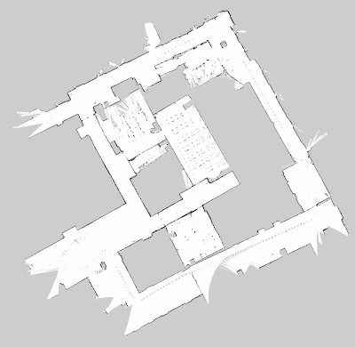

# akig_2020
AKIG 2020 TU Wien


In diesem Jahr soll im Rahmen von AKIG der selbst fahrende Roboter [Husky](https://clearpathrobotics.com/husky-unmanned-ground-vehicle-robot/) um Funktionen im Zusammenhang mit dem Tachymeter erweitert werden. Neben der 2D- und 3D-Aufnahme des Raumes ist in der Ingenieurgeodäsie vor allem die Bewertung der Genauigkeit und Zuverlässigkeit der erzeugten Daten von Bedeutung. Zu entwickeln ist ein maximal autonom agierendes System, welches in der Lage ist sich selbstständig in einem zu schaffenden Industriemessnetz zu orientieren und zu navigieren. Als Methode kommen für den Husky bereits implementierte [ROS-Packete](http://wiki.ros.org/Robots/Husky) wie etwa [gmapping](http://wiki.ros.org/gmapping) zum [Einsatz](https://www.youtube.com/watch?v=XQg-1DZRqQo). 


Das Tachymeter erzeugt ground-truth Daten wie sie in der Robotik allgemein nicht zur Verfügung stehen, Daher sind neue Ansätze zu entwickeln die mit Blick auf die bekannten geodätischen Methoden auch in der Informatik eingang finden können.

Folgende Meilensteine wurden bisher definiert:

- Aufbau eines Messnetzes
- Anschluss des Messnetz ans Landesnetz
- Tachymetersteuerung mit Hilfe der verfügbaren Matlab-Toolbox
- Automatisches Tracking der Robotertrajektorie mittels Tachymeter (Tachymeter steht extern)
- Automatische Aufnahme von Zielzeichen und Bestimmung der Pose (Tachymeter fest auf Roboterplattform)
- Erzeugen einer 2D Karte der Umgebung, Transformation dieser Karte ins übergeordnete Netz
- Aufnahme einer 3D Punktwolke, mittels 2D Laserscanner und bekannter dynamischer Pose

Es wird im folgenden davon ausgegangen, dass die Installation eines passenden [Ubuntu Systems (16.04, 18.04 oder 20.04)](https://ubuntu.com/download/desktop) mit dem dazu gehörigen [ROS-System (kinetic, melodic oder noetic)](http://wiki.ros.org/ROS/Installation) bereits vollständig durcheführt wurde. Spieziell für Raspberry Pis (Version 4) ist eventuell folgender [Blogeintrag](https://finnlinxxx.github.io/RaspRos4/) hilfreich.

## 0.1 Installation - Husky

In Anlehnung an das [ROS-Tutorial](http://wiki.ros.org/ROS/Tutorials), soll ein eigener Workspace auf dem Raspberry Pi, der virtuellen Linux Umgebung oder sonst irgendeinem Linux-System, welches auf dem Ubuntu läuft, erzeugt werden (siehe Kapitel [1.3.](http://wiki.ros.org/ROS/Tutorials/InstallingandConfiguringROSEnvironment)). Statt `catkin_ws` ist ein anderer Name zu wählen, etwa `workspace_husky`. Im dazu gehörigen `workspace_husky/src` Ordner können beliebig viele [ROS-Packages](http://wiki.ros.org/Packages) abgelegt werden, `catkin` übernimmt einen großteil der Verwaltung zur Erzeugung lauffähiger Programme bzw. Nodes. 

Um einzelne bereits vorhandene und gut getestete Packages zu installieren, ist die Paketmanager-Option `apt install` zu benutzen. Die Packages werden tief im System abgelegt/installiert `$ cd /opt/ros/noetic/...` und stehen somit jedem Benutzer zur Verfügung, evtl. muss vor dem Verwenden das Terminal neu gestartet werden oder `$ source ~/.bashrc` erneut ausgeführt werden.
```bash
$ sudo apt install ros-melodic-imu-tools
$ sudo apt install ros-melodic-eigen-stl-containers
$ sudo apt install ros-melodic-tf2-sensor-msgs
$ sudo apt install ros-melodic-pcl-ros
$ sudo apt install ros-melodic-laser-filters

(oder eben)
$ sudo apt install ros-noetic-imu-tools
$ sudo apt install ros-noetic-eigen-stl-containers
$ sudo apt install ros-noetic-tf2-sensor-msgs
$ sudo apt install ros-noetic-pcl-ros
$ sudo apt install ros-noetic-laser-filters
```

Grundsätzlich stehen auch installierbare Packages für den Husky oder den Laserscanner zur Verfügung, jedoch wollen wir in Zukunft im verfügbaren Quellcode selbst entwickeln, sodass eine einfache Installation nicht in Frage kommt. Der Sourcecode soll in einen eigenen Workspace geladen werden und liegt somit an der dieser Stelle anschließend bereit.

Folgende Packete sind mit folgenden Befehlen in den Workspace zu laden :
```bash
$ cd ~/workspace_husky/src
$ git clone https://github.com/ethz-asl/ethzasl_xsens_driver.git
$ git clone https://github.com/husky/husky.git
$ git clone https://github.com/clearpathrobotics/LMS1xx
$ git clone https://github.com/team-vigir/vigir_lidar_proc.git
$ cp -r ~/akig_2020/src/mss_tools .
```
Außerdem ist mittels `git` der für das eigene System benötigte Branch auszuwählen (in diesem Beispiel im Bezug auf die ROS Version `noetic`). Ist kein passender Branch für das eigene System verfügbar kann das nächstbeste ausgewählt werden, eventuell ist dieses trotzdem über catkin kompilierbar:
```bash
$ cd ~/workspace_husky/src/husky
$ git checkout noetic-devel
$ cd ..
$ cd ~/workspace_husky/src/LMS1xx
$ git checkout noetic-devel
```
Anschließend ist der Workspace mit `$ catkin_make` zu kompilieren, eventuell auftretende Fehlermeldungen sind zu behandeln.
```bash
$ cd ~/workspace_husky
$ catkin_make
```

Eventuell findet catkin PCL nicht, dann:
```bash
$ locate PCLConfig.cmake
```
Dort wird der Pfad angezeigt, wo PCL zu finden ist, dies muss nun in den CMakeList des Workspaces eingetragen werden, hierfür braucht es sudo rechte.
```bash
$ cd workspace_husky/src
$ sudo nano CMakeLists.txt

Und dort unter der Zeile:
set(CATKIN_TOPLEVEL TRUE)
dann folgende Zeile eintragen: der Pfad ist der oben mit locate festgestellte.
set(PCL_DIR "/usr/lib/arm-linux-gnueabihf/cmake/pcl/")
speichern und schließen.
````

Nun muss eventuell 2-3 catkin_make ausgeführt werden, bis das Projekt vollständig gebaut ist [100%].
```bash
$ catkin_make
$ catkin_make
$ catkin_make
```
Die Anmeldung des Workspaces ins System erfolgt wie gewohnt über den `$ source .` Befehl, etwa:
```bash
$ source ~/workspace_husky/devel/setup.bash
```
Praktischerweise sollte dieser Befehl nach eigenem Ermessen in die `$ nano ~/.bashrc` geladen werden, um bei jedem Terminal verfügbar zu sein.

Anschließend muss die Node 
```bash
$ roslaunch husky_viz view_robot.launch
```
aufrufbar sein. Es startet das bereits bekannte rviz Visualisierungstool mit getroffenen Voreinstellungen die im Bezug auf den Husky optimiert wurden. Ist das rviz Fenster geöffnet kann aber sogleich in der Linken Spalte der Haken bei `Sensing/Odometrie` ⬜️ entfernt werden, da dies für die nun folgende Visualiserung hinderlich ist. Dafür sollte aber der Haken bei `Navigation` ✅ gesetzt werden, um eine sich aufbauende Karte beobachten zu können. Zusätzlich sollen in rviz über `>> Add >> TF >> Ok` die TF-Frames ebenfalls visualisiert werden. 

Ein passendes rosbag, dass zuvor erfasste Sensordaten des realen Huskys erneut ins System ausspielt kann über [TUWEL](https://tuwel.tuwien.ac.at/course/view.php?id=33880) geladen werden (TU Zugangsdaten notwendig).

Bagfiles nehmen grundsätzlich den gesamten Datenstrom des ROS-Masters auf, dafür kann im laufenden Betrieb folgender Befehl ausgeführt werden.
```bash
$ rosbag record -a
```
Allerdings fallen im Fall des Huksy innerhalb weniger Sekunden mehrere 100 MB Daten an, daher wurde für das folgende Beispiel das erzeugte rosbag mit der filter Methode ausgedünnt:

```bash
$ rosbag filter my_big_record.bag huskdrive_90degcorner_5m_sparse.bag "topic == '/tf' or topic == '/tf_static' or topic == '/scan' or topic == '/map'"
```
Übrig bleibt ein rosbag mit den für den Anfang wichtigsten topics.

Das dort heruntergeladene Bagfile `huskdrive_90degcorner_5m_sparse.bag` kann wie gewohnt über den folgenden Befehl ausgeführt werden.
```bash
$ rosbag play huskdrive_90degcorner_5m_sparse.bag --loop
```
In Rviz sollte die Punktwolke, die sich aufbauende Karte und die vielen verschiedenen TF-Frames visualisert werden. Der Husky-Roboter fährt in diesem Beispiel auf etwa 5 Meter Distanz eine 90 Grad Kurve um eine Ecke, die Aufnahme ist nur 10 Sekunden lang und wiederholt sich wegen dem `--loop` Argument fortlaufend. Eventuell ist in rviz ganz unten link der "reset" Button zu drücken, um die Visualiserung vom neuen zu zeigen.

Über den Befehl
```bash
$ rostopic list
```
können alle zur Verfügung stehenden Topics eingesehen werden. 

Die zueinander stehenden Koordinatensyteme (TF-Frames bzw. /tf) sind für dieses Projekt vom großen interesse. Verfügbare und in rviz einsehbare Frames und wie diese zueinander im Verhältnis stehen (zb. map zu base_link) können über folgenden Befehl eingesehen werden.

```bash
$ rosrun tf tf_echo map base_link
```
Im Weiteren ist die Auswertung mit Programmcode zu erfolgen, vorzugsweise mit Python (siehe weiter unten).

## 0.2 Installation - Sick&xsens 3D PW-Transformation

(nur für Dokumentationszwecke)

Die Aufnahme erfolgte mit dem Befehl:
```bash
$ rosbag record /scan_cloud /imu/data /imu/data_raw /transformed_ptcl
(strg+c)
$ mv name_or_record.bag sensorikraum2.bag
```
---
(nur für Dokumentationszwecke)

Um `sensorikraum2.bag` auswerten zu können musste ich zunächst das bagfile in Ordnung bringen. Hierfür habe ich ein eigenes python skript erstellt, in dem die `child_frame_id` des `/imu/data`-Topics von `/imu` auf `imu` geändert wird. Der char `/` ist in diesem zusammenhang nicht erlaubt.

`$ nano rewrite_frame_id_rosbag.py`
```python
import rosbag
import sys

inbag_name = sys.argv[1]
outbag_name = inbag_name.replace('.bag', '-fixed.bag')

with rosbag.Bag(outbag_name, 'w') as outbag:
    for topic, msg, t in rosbag.Bag(inbag_name).read_messages():
        if topic == "/imu/data" and msg.header.frame_id:
            msg.header.frame_id = "imu"
            outbag.write("/imu/data", msg, t)
        else:
            outbag.write(topic, msg, t)
 ```
 Zum verwenden:
 ```bash
 $ python3 rewrite_frame_id_rosbag.py sensorikraum2.bag
 ```
Die erstellte `sensorikraum2-fixed.bag` Version kann anschließend weiter verwendet werden.

---

Nun könnten die Topic `/imu/data`, `/scan_cloud` und `/transformed_ptcl` in `rviz` visualisiert werden. Hierfür einfach über `>>File >> Open Config >> xsenssick3d.rviz` des codebeispiele Ordners laden. Um auch das `/imu/data_raw` Topic laden können, muss dieses im rewrite_frame_id_rosbag.py-Skript angepasst werden.

```bash
$ roscore
$ rosparam set /use_sim_time true
$ rosbag play --clock sensorikraum2-fixed.bag --loop
$ rosrun tf2_ros static_transform_publisher 0 0 0 0 0 0 map laser
$ rosrun tf2_ros static_transform_publisher 0 0 0 0 0 0 map imu

$ rosrun rviz rviz
(Entweder die xsenssick3d.rviz Datei laden oder...)
(Add >> rviz_imu_plugin/Imu >> Ok und in rviz in der linken Spalte topic wählen und "enable box ✅" und dort _scale anpassen)
(Add >> TF >> Ok)
(Add >> PointCloud2 >> Ok)
```

Angenommen man möchte das `/scan_cloud` Topic um 7 Meter in x-Richtung verschieben, dann muss nur der `laser`-Frame angepasst werden, etwa:
```bash
$ rosrun tf2_ros static_transform_publisher 7 0 0 0 0 0 map laser
```
Die `/transformed_ptcl` zu verschieben/verdrehen ist nicht so ohne weiteres möglich, da diese als `frame_id:=map` hat und die `map` liegt definitionsgemäß im Ursprung, aber auch hier wäre eine Anpassung/Umschreibung mit dem `rewrite_frame_id_rosbag.py` möglich. 


## 0.3 GIT - First steps

GIT ist ein mächtiges Tool, um Programmierern und Teams die Möglichkeit zu geben gemeinsam und projektbezogen die Datenhaltung übersichtlich zu gestalten. In immer größer werdenden Projekten ist die Übersicht über das Projekt wichtig und auch ganz ohne GIT eine Herausforderung. Auch wenn GIT also erstmal unübersichtlich und kompliziert daher kommt, viele andere Ansätze eine Versionsverwaltung zu realisieren (zb. in einer Dropbox `#FINAL_v13_fertig_letzteVersion_Abgabe_LinzerFinn_17122021_12h33xxx.docx`) sind gruseliger.

Es benötigt einige Zeit sich die Befehle zu eigen zu machen und es braucht eben auch Gelegenheiten problembezogen mit GIT umgehen zu können. Daher wollen wir in AKIG zumindest ansatzweise mit GIT umgehen, ein großes Tutorial findet sich sobald man danach googled an vielzähligen Stellen. Man kann sagen, dass wenn man 3% der Git-Funktionalitäten beherscht 80% der allgemeinen Aufgaben lösen kann.

Damit ihr Daten und Ordner in dieses Repository hochladen könnt ist es wichtig, dass ihr mir euren Github Namen nennt, sodass ich euch zu der Liste der Collaboratoren hinzufügen kann. Das ermöglicht euch sogenannte `Branches` anzulegen. Wenn man `Branch` übersetzt, dann bedeutet das soviel wie Abzweigung, ihr zweigt also aus dem aktuellen Projektzustand ab und in dieser Abzweigung könnt ihr eure eigenen Daten hinzufügen. Erst zu einem späteren Zeitpunkt, wenn klar ist, dass eure Arbeit eine "Verbesserung" im Sinne des Projekts ist, wird dieser Abzweigung wieder zum Hauptprojekt (main oder auch master) zurückgeführt (merge).

Angenommen ihr habt also das aktuelle Git Repository heruntergeladen zB.
```bash
$ cd ~
$ git clone https://github.com/FinnLinxxx/akig_2020.git

Dann liegen die Dateien nun im Ordner `akig_2020`, deren Inhalt wir anschauen können.

$ cd akig_2020
$ ls
```

Alternativ könnt ihr das Git-Repository mit dem Befehl
```bash
$ cd ~
$ git pull
```

auf den neuesten Stand bringen. Aber vorsicht, dies ist nur problemlos möglich, wenn keine Dateien heruntergeladen werden, an denen ihr zuvor gearbeitet habt.  Dann weiß git nicht implizit welche der beiden Versionen (eure oder die vom Repository) die richtige sein soll. Falls ihr eine Fehlermeldung wie diese bekommen solltet, dann schaut bitte in ein richtiges Git Tutorial bzw. sucht im Internet nach dem Fehler und dessen Behebung. Git schützt euch davor solch grobe Fehler zu begehen. Umstände wie diese sorgen aber auch dafür, dass ich innerhalb dieser kurzen Übersicht nicht auf alle Problemstellungen direkt eigehen kann.

Um den aktuellen Status des Repositorys zu ermitteln navigiert ihr also in die Ordnerstruktur wie gezeigt hinein und gebt dort `$ git status` ein. Wenn ihr grade erst das Repo geladen habt und noch keine Änderung gemacht habt, erscheint dort der Hinweis `nothing to commit`. Ein Commit, dass ist ein Zeit und Kommentargestempelter Zustand eures Repositorys aus eurem eigenen Computer. Wenn ihr also einen sogenannten commit durchführt wird der aktuelle Zustand des Repos auf eurem Computer git-mäßig gesichert - nun, wer keine Änderung vorgenommen hat, kann auch nichts commiten. Ein Commit ist nach eigenem Ermessen durchzuführen, wenn man mit den Ánderungen die man vorgenommen hat zufrieden ist und das Gefühl hat der Aufgabenstellung einen Schritt weiter gekommen zu sein (ähnlich wie wenn man beim Schreiben einer Bachelorarbeit das Gefühl hat mal wieder auf das "Save" Symbol klicken zu müssen). 

Ich, Finn, bearbeite eine Datei (zum Beispiel diese Readme) und führen danach einen Commit aus. 

```bash
$ cd ~/akig_2020
$ nano README.md
```
Ersetze nun den Namen Finn von zuvor, durch einen anderen Namen und speichere die Datei.
```bash
$ git status
```

Nun erscheint diese und evtl. andere Dateien die ihr schon bearbeitet hattet als modified, etc...
Da wir die Änderung nicht im Hauptzweig (main bzw. master) machen sollten (und dürfen) erstellen wir zunächst den eigenen Branch
```bash
$ git checkout -b finnsbranch
$ git status
```
gibt nun den aktuellen Branch an.

Mit
```bash
$ git add .
```
bereiten wir die aktuellen (mit git status angezeigten) Änderung für den commit vor. Der `.` gibt an, dass wir alles vom aktuellen Ordnerpfad aus hinzufügen wollen, es ist ebenfalls möglich nur einzelne explizit benannte Dateien für den Commit vorzubereiten.

Nach dem Hinzufügen können wir den Commit durchführen
```bash
$ git commit -m "Hier nun ein Kommentar zu den gemachten Änderungen die für jeden verständlich sind"
```

Schauen wir jetzt wieder den `$ git status` an, gibt dieser an, dass wir nichts weiter zu commiten haben. Theoretisch können wir diese Änderung nun hochladen bzw. pushen, damit diese gut gesichert im Repository liegen. Analog zur Bachelorarbeit wäre dies das anlegen einer Sicherheitskopie bzw. eines Backups, vor allem nach einem Arbeitsreichen Tag oder einer besonders wichtigen Änderung sollte man dies beim Arbeiten mit dem GIT-Projekt bzw. mit der Bachelorarbeit durchführen. Bevor ihr nicht gepusht habt, kann ich eure Änderung überhaupt nicht im Git-Repository sehen. 

Um zu pushen folgende Befehle durchführen:
```bash
$ git push origin finnsbranch
(evtl. werdet ihr nun nach Benutzername und Passwort gefragt)
```
Weitere Änderungen die ihr nun vornehmen wollt müssen ebenfalls wieder commitet und dann gepusht werden. Um eure Änderungen in das main bzw. master Repository zu bekommen müsst ihr mit dem Projektverantwortlichen immer Rücksprache halten. Hierbei kann es zu größeren Diskussionen zwischen den Programmierenden kommen, welche Änderungen in den Hauptzweig hinein kommen sollen. Der Hauptzweig sollte stets sauber gehalten werden und grundsätzlich Lauffähig (python programme, webseiten) und kompilierbar sein (C++, LaTex,...). Wenn einzelne Programmierarbeiten zb. ein neues Tool zur Navigation des Roboters aufgesetzt werden kann es sein, dass die neuen Programmbestandteile über Monate hinweg im Branch eines Projekts liegen, bis diese Reif genug sind, auch im Hauptzweig eingang zu finden.


Wenn ihr auf Probleme stoßt, dann kopiert euch die Meldung und gebt diese bei Google, Bing, Duckduckgo ein. Sehr häufig findet ihr dort sofort eine Lösung für eurer Git-Problem.


## 1. Provide Fixed-point field
`Andreas S.`

Zur Verfügung stellen einer [PointCloud2](http://docs.ros.org/en/melodic/api/sensor_msgs/html/msg/PointCloud2.html) die die Fixpunkt der Netzmessung im 2. Stock der Ingenieurgeodäsie als Topic zur Verfügung stellt. Evaluierung der Sinnhaftigkeit sogenannter ["Dynamic Reconfiguration"](http://wiki.ros.org/dynamic_reconfigure) die es ermöglichen soll die Koordinatenliste mit eventuell vorhandenen Meta-Daten ins System zu bringen.

Das Skript `$ nano ~/akig_2020/codebeispiele/andreasslateff/publish_fixpoints.py`, welches bereits Punkte einer Textdatei `$ nano ~/akig_2020/codebeispiele/andreasslateff/fixed-points.txt` einliest und als `/fixed_points` zur Verfügung stellt soll dementsprechend erweitert werden.

Ausführung des Beispiels:
```bash
$ roscore
$ cd ~/akig_2020/codebeispiele/andreasslateff
$ python3 publish_fixpoints.py
```

> **Ziel**: Die Aufgabe ist es weitere mögliche Meta-Daten zu evaluieren und im Sinne der "dynamic_reconfigure"-Funktion an das System zu übergeben. Eine .cfg Datei beschreibt gut nachvollziehbar den Einlesevorgang.

## 2. Publish PoseStamped
`Victoria`

Ermitteln der akutellen Pose und publishen eines Topics, welches dies statt als [TwistStamped](http://docs.ros.org/en/melodic/api/geometry_msgs/html/msg/TwistStamped.html) als [PoseStamped](http://docs.ros.org/en/melodic/api/geometry_msgs/html/msg/PoseStamped.html) ausgibt.


Ausführung des Beispiels:
```bash
$ roscore
$ rosparam set /use_sim_time true
$ roslaunch husky_viz view_robot.launch (odometrie aus, navigation an, evtl Add >> TF)
$ rosbag play huskdrive_90degcorner_5m_sparse.bag --loop --clock
$ cd ~/akig_2020/codebeispiele/victoria
$ python3 husky_tf2pose.py    (muss bei jedem Durchgang der --loop neu gestartet werden)
$ rostopic echo /husky/cmd_vel
$ rosrun tf tf_echo map base_link
```

```python

1    def callback(data, args):
2    ...
3   
4    rospy.init_node('husky_tf2pose')
5
6    tflistener = TransformListener()
7    husky_vel = rospy.Publisher('husky/cmd_vel', geometry_msgs.msg.TwistStamped,queue_size=1)
8    cmd = geometry_msgs.msg.TwistStamped()
9    rospy.Subscriber("/tf", TFMessage, callback, (tflistener, husky_vel, cmd))
```
(1) die Callback-Funktion wird immer aufgerufen, wenn eine neue Nachricht auf dem `/tf` Topic zur Verfügung steht (siehe Zeile 9, 3. Argument).

(4) benennt den Namen dieser Rosnode

(6) TransformListener sind in der Lage `/tf`-Frames und die Beziehungen untereinander zu ermitteln (siehe code der zu Zeile (2) gehört).

(7) erzeugt einen Publisher der ein Topic mit dem Namen `husky/cmd_vel` und dem Typ `TwistStamped` erzeugt. Wird in Zeile (9) an den Subscriber mit übergeben (siehe 4. Argument (Teil der Argumentenliste)). 

(8) Deklaration einer `TwistStamped` Variablen, welche in Zeile (9) an den Subscriber mit übergeben (siehe 4. Argument (Teil der Argumentenliste)).

(9) Aufbau eines Subscribers, welcher auf das `/tf`  Topic hört (1. Argument), dies ist von Typ `TFMessage` (2. Argument) und löst die callback-Funktion aus (3. Argument). An diese Callback-Funktion werden die Variablen `(tflistener, husky_vel, cmd)` übergeben, um dort mit diesen weiter zu arbeiten.

> **Ziel**: Der verfügbare Subscriber/Publisher `husky_tf2pose.py` soll so bearbeitet werden, dass statt dem `TwistStamped` ein `PoseStamp` als Topic an das System übergeben wird. 


## 3. Publish Hz, V, D
`Matthias`

Bewegt sich der Roboter durch den zweiten Stock kann das Tachymeter wichtige Informationen zur aktuellen Position sammeln. Im Stand oder sogar während der Fahrt können hierfür die eingemessenen Punkte des Punktfeldes herangezogen werden. Um eine Messung auszuführen muss das Tachymeter zu den einzelnen Punkten ausgerichtet werden, hierfür reicht eine relativ grobe Richtungsvisur (hz, v) aus. Sind die Koordinaten des Punktfeldes und die aktuelle Pose des Roboters bekannt können diese Werte berechnet werden.

Daher sollen die Fixpunkte von Andreas S. als [PointCloud2](http://docs.ros.org/en/melodic/api/sensor_msgs/html/msg/PointCloud2.html) aufgegriffen werden. Die aktuelle Pose ergibt sich aus der Aufgabe von Victoria.

Neben x,y und z kann eine PointCloud2 um beliebig viele Felder erweitert werden. Daher ist eine Punktwolke zu publishen, die die berechneten Werte `hz`,`v`,`d`,... stets enthält.

Siehe hierfür die Ausführung (ähnlich zur Aufgabe 1):
```bash
$ vim ~/akig_2020/codebeispiele/matthias/publish_fixpoints_plusMeta.py
```

```python
1 points = []
2 for pt_from_list in fixed_point_ptcl:
3    points.append([pt_from_list[1], pt_from_list[2], pt_from_list[3]])
4
5    fields = [  PointField('x', 0, PointField.FLOAT32, 1),
                PointField('y', 4, PointField.FLOAT32, 1),
                PointField('z', 8, PointField.FLOAT32, 1),
                # PointField('rgb', 12, PointField.UINT32, 1),
              ]
6 header = Header()
7 header.frame_id = "map"
8 pc2 = point_cloud2.create_cloud(header, fields, points)
9 pc2.header.stamp = rospy.Time.now()
10 pub.publish(pc2)             
```

(1) Deklaration einer Liste in python

(2) durch alle Punkte einer Numpy Matrix (fixed_point_ptcl) iterieren

(3) Hinzufügen eines Punkte anhand der Punktkoordinaten aus der Numpy Matrix

(5) Beschreiben der Felder die zur PointCloud2 gehören (3 Zuweisung zu 3 Hinzufügungen aus Zeile (3))

(6,7) Normalen Header erzeugen und Frame Id setzen

(8,9) PointCloud2 mit header, zugewiesenen Feldern und den Punkten erzeugen

(10) Publishen als Topic

Wie ein Subscriber geschrieben werden kann, der auch gleichzeitig Published ist der Aufgabe 2 (victoria) zu entnehmen.

> **Ziel**: Die Aufgabe ist dann gelöst, wenn eine [PointCloud2](http://docs.ros.org/en/melodic/api/sensor_msgs/html/msg/PointCloud2.html) gepublished wird die neben den x,z,y-Koordinaten auch hz,v,d als [PointField](http://docs.ros.org/en/melodic/api/sensor_msgs/html/msg/PointField.html) enthält. 


## 4. Publish 2D probability Map
`Max`

Publishen einer probability Map, diese soll bezogen auf eventuell ground-truth Daten skalierbar sein.
Eine solche probability Map steht unter `$ cd ~/akig_2020/records/saved_maps` zur verfügung.



Für Beispiele siehe ROS-Package [map_server](http://wiki.ros.org/map_server)

> **Ziel**: Die Aufgabe ist dann gelöst, wenn wir wissen wie man eine probability Map in ROS skaliert einladen kann. 


## 5. Publish transformed Pointcloud
`Andreas B.`

Um nun die lokal vom SICK gemessene `/scan_cloud` im Bezug auf die Örtlichkeit zu transformieren steht das `/imu/data` Topic zur verfügung, dass die zeitlich passende Orientierung des Systems zur Verfügung stellt. Koordinaten wurden in diesem Zusammenhang nicht bestimmt, bei einer reinen Verdrehung des Systems ist dies zu vernachlässigen (0,0,0). 

Zunächst muss in der Algorithmik ein neuer TF-Frame erzeugt werden, welcher nicht statisch, sondern im Bezug auf die festzustellende Verdrehung der IMU ausgerichtet werden muss, im folgenden `prisma_frame` genannt. Die Punktwolke der `/scan_cloud` muss anschließend auf die `frame_id:=prisma_frame` bezogen werden, sodass eine räumliche Transformation erzeugt werden kann.

Der Installation von oben folgend liegen im `$ cd ~/workspace_husky/src/mss_tools`-Ordner passende Packages vor. Diese wurden in C++ geschrieben.

`1. platform_tf` mit dem C++ Programm `listen_platform_tf_talker.cpp`

Erzeugt den TF-Frame, ausführbar mit (wenn keine `tachy_points` gepublished werden wird 0,0,0 angenommen):
```bash
$ rosrun platform_tf listen_platform_tf_talker /tachy_points /imu/data 22
```

`2. tf_points_global` mit dem C++ Programm `transform_point2pointcloud.cpp`

nimmt den TF-Frame auf und erzeugt eine neue Punktwolke mit neuem Namen.
Ausführbar mit:
```bash
$ rosrun tf_points_global transform_point2pointcloud _ptcl2_global_frame:=map _ptcl2_local_frame:=prisma_frame _ptcl2_input_topic:=/scan_cloud _ptcl2_output_topic:=/transformed_new_pw _drop_when_same_position:=false
```

> **Ziel**: Die Aufgabe ist dann gelöst, wenn die `/scan_cloud` in einem übergeordneten Koordinatesystem transformiert vorliegt. Die benannten Programme lösen dies recht kompliziert bereits in C++, die neue Umsetzung soll in Python geschrieben werden.


