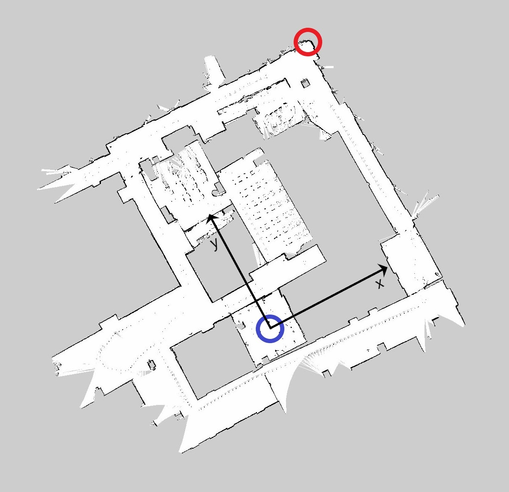

# Visualisierung in rviz

Dieses Tutorial soll zeigen, wie man eine Karte im ROS-Visualisierungstool rviz nach gewissen Vorstellungen darstellen kann. Dazu wird von einem relativ einfachen Beispiel ausgegangen, in dem die Koordinaten von 2 Punkten definiert werden, sowohl im Koordinatensystem der Karte als auch in einem übergeordneten Koordinatensystem (tatsächliches Koordinatensystem vor Ort). Der Maßstab und die Orientierung zwischen diesen beiden Systemen werden daraufhin ermittelt. Anschließend soll der Ursprung des übergeordneten Systems ins Zentrum der Visualisierungssoftware verschoben werden.

## Vorbereitung

Um eine Karte in rviz anzeigen zu können, muss diese zunächst mithilfe der ROS-node `map_server` gepublisht werden. Der Befehl dazu sieht wie folgt aus, nachdem roscore und rviz zum Laufen gebracht werden:
```bash
$ roscore
$ rosrun rviz rviz
$ rosrun map_server map_server karte
```

Die für dieses Tutorial verwendete Karte befindet sich in diesem Ordner (`akig_2020/codebeispiele/max`). Neben der Occupancy Grid Map selbst (`ig_2stock_map_30092020.pgm`) lässt sich eine weitere Datei finden, welche in diesem Zusammenhang relevant ist (`ig_2stock_map_30092020.yaml`). Das yaml-File beinhaltet nämlich Informationen wie Ursprung, Verdrehung und Auflösung, mit denen die Karte in rviz visualisiert wird. Nähere Infos sind auf der [Wikiseite](http://wiki.ros.org/map_server), Abschnitt 1.2 zu finden.


```bash
image: ig_2stock_map_30092020.pgm
resolution: 0.050000
origin: [-100.000000, -100.000000, 0.000000]
negate: 0
occupied_thresh: 0.65
free_thresh: 0.196
```

Somit kann diese Karte gepublisht werden.
```bash
$ rosrun map_server map_server ig_2stock_map_30092020.yaml
```

Im Anschluss muss auf `Add` geklickt, der display type `Map` ausgewählt und schließlich auf `OK` geklickt werden. Dann müssen die Informationen mit dem Pfeil neben `Map` aufgelistet werden und unter Topic `/map` ausgewählt und mit Enter bestätigt werden. Die Karte ist nun in rviz sichtbar. Mit gedrückter linker Maustaste kann die Karte verdreht und mit gleichzeitig gedrückter Shift-Taste verschoben werden. Mit dem Mausscroller kann man hinein- und hinauszoomen. Es fällt einem sofort auf, dass die Karte, bezogen auf das rviz-Zentrum (Zentrum des 10x10 Kästchenfeldes), willkürlich gelagert und orientiert ist. Nach Eingabe der Tastenkombination `Strg+C` in der Shell kann das Publishen der Karte unterbrochen werden.

## Durchführung

Dieses Problem soll nun mit dem Pythonskript `change_map_data.py` behoben werden. Für dieses wird jedoch das Package `ruamel.yaml` benötigt, welches zunächst installiert werden muss.
```bash
$ pip3 install ruamel.yaml
```

Nun muss darauf geachtet werden, dass sich das Skript und die beiden Karten-Dateien tatsächlich im selben Ordner befinden. Nachdem diese Vorkehrungen getroffen wurden, kann man das Skript, wie folgt, ausführen:
```bash
$ python3 change_map_data.py
```

Zuallererst erscheint ein Fenster, in der eine verkleinerte Version der Karte gezeigt wird. (Möglicherweise ist das Fenster anfangs zu klein, um die Karte repräsentieren zu können. In diesem Fall einfach das Fenster vergrößern.) Hier wird man dazu aufgefordert, gewisse Bildkoordinaten zu bestimmen. Wie am Anfang des Tutorials schon erwähnt, werden für dieses simple Beispiel nur 2 Punkte benötigt. Das Messen der Bildkoordinaten erfolgt durch das Klicken mit der linken Maustaste. So könnte man als Erstes in die Mitte des blauen Kreises klicken, wie im nachfolgenden Bild zu erkennen ist. Die gemessenen Bildkoordinaten werden in der Shell ausgegeben. Dieser erste Punkt befindet sich somit im Sensorikraum und entspricht gleichzeitig auch den Ursprung des übergeordneten Koordinatensystems, welches in diesem Beispiel näherungsweise durch die ebenfalls im Bild ersichtlichen x- und y-Achse definiert wird. Daher hat der erste Punkt die Koordinaten (0, 0) m im übergeordneten System. Der zweite Punkt liegt, im Zuge dieses Beispiels, in der Mitte des roten Kreises. Nachdem dieser gemessen wurde, kann mit Enter (oder einer anderen beliebigen Taste) dieser Vorgang beendet werden.



Als Nächstes fragt das Programm nach den Koordinaten des zweiten Punktes im übergeordneten System. In diesem Fall beträgt der tatsächliche x-Wert ungefähr 24 m, und für den y-Wert kann 33 m angenommen werden. Zuerst wird also `24` in die Shell eingegeben und mit Enter bestätigt. Danach erfolgt dasselbe mit `33`.

Im Anschluss findet die eigentliche Berechnung statt. Der Maßstab und der Drehwinkel zwischen übergeordnetem und Kartensystem werden bestimmt. Mit diesen lässt sich dann der Verschiebungsvektor vom Ursprung des übergeordneten Systems ins Zentrum der rviz-Visualisierung berechnen. Diese neu gewonnen Daten werden abschließend in das neue File `ig_2stock_map_30092020_new.yaml` geschrieben. Nun muss dieses neue File gepublisht werden und das Ergebnis lässt sich schließlich in rviz begutachten.
```bash
$ rosrun map_server map_server ig_2stock_map_30092020_new.yaml
```

Man sieht, dass sich nun der Sensorikraum im rviz-Zentrum befindet und dass sich die Grid Map an die Achsen des übergeordneten Systems ausrichtet. Ebenfalls ist die Tatsache bemerkbar, dass sich die Karte aufgrund der Veränderung des Maßstabs ein wenig vergrößert hat.


